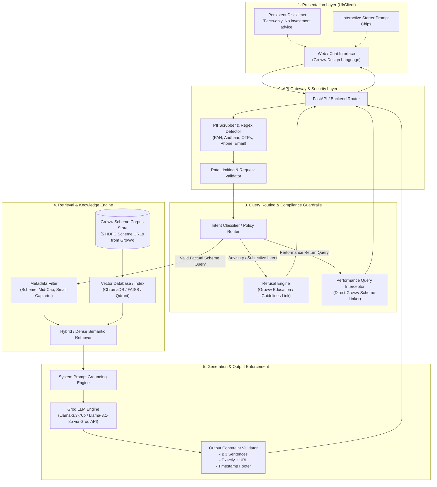
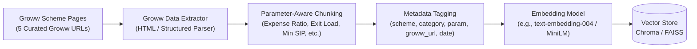
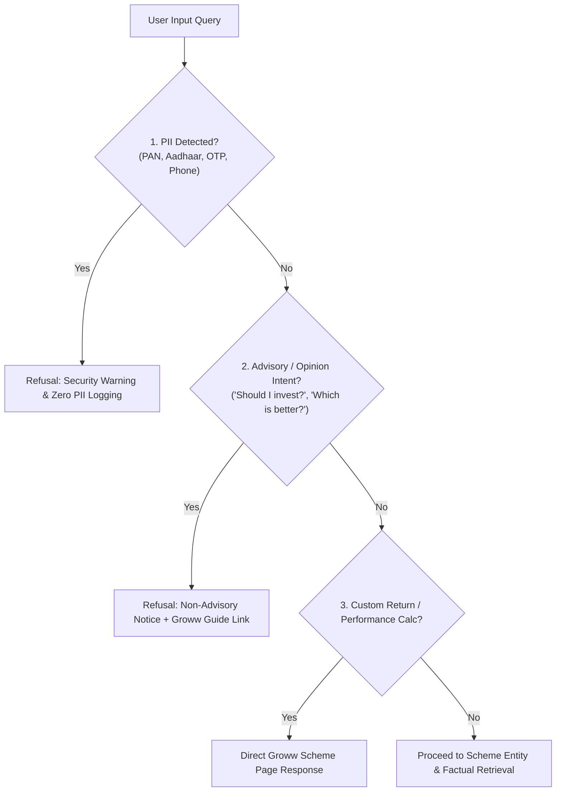
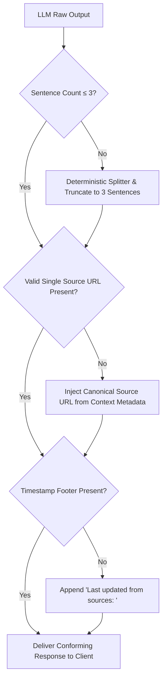
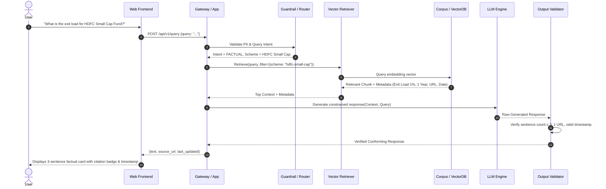
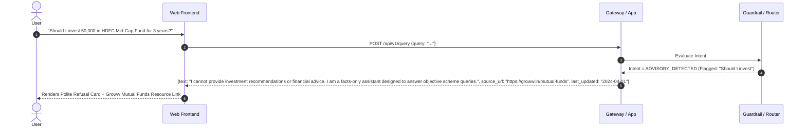

# System Architecture: Mutual Fund FAQ Assistant (Facts-Only RAG)

---

## 1. Architecture Overview & Design Principles

The **Mutual Fund FAQ Assistant** is a specialized, compliance-first Retrieval-Augmented Generation (RAG) system designed to deliver verified, factual mutual fund scheme data. Built around the reference product paradigm of **Groww**, the system operates under a strict **"Accuracy Over Intelligence"** principle.

### Key Architectural Tenets
1. **Zero Advisory Hallucination**: Strict pre-retrieval and post-generation guardrails prevent opinions, stock picks, or return predictions.
2. **Deterministic Attribution**: Every factual answer is linked to exactly one verified Groww scheme source URL (`groww.in/mutual-funds/...`).
3. **Format Conformance Guarantee**: Hard programmatic constraints enforce a 3-sentence maximum limit and a mandatory source timestamp footer.
4. **Zero PII Exposure**: Absolute refusal to ingest, process, or store sensitive financial or personal identity data (PAN, Aadhaar, account numbers, OTPs).

---

## 2. High-Level System Architecture



---

## 3. End-to-End Component Breakdown

### 3.1 Corpus & Source Model (Groww Scheme URLs)
The knowledge corpus is built exclusively from **verified Groww scheme pages**, establishing a single authoritative ground-truth source model.

#### Canonical Groww Scheme URLs:
| Scheme Name | Category | Canonical Groww Source URL |
| :--- | :--- | :--- |
| **HDFC Mid-Cap Opportunities Fund** | Equity: Mid Cap | `https://groww.in/mutual-funds/hdfc-mid-cap-fund-direct-growth` |
| **HDFC Small Cap Fund** | Equity: Small Cap | `https://groww.in/mutual-funds/hdfc-small-cap-fund-direct-growth` |
| **HDFC Gold ETF Fund of Fund** | Commodities: FoF | `https://groww.in/mutual-funds/hdfc-gold-etf-fund-of-fund-direct-plan-growth` |
| **HDFC Top 100 / Large Cap Fund** | Equity: Large Cap | `https://groww.in/mutual-funds/hdfc-large-cap-fund-direct-growth` |
| **HDFC ELSS Tax Saver Fund** | Equity: ELSS | `https://groww.in/mutual-funds/hdfc-elss-tax-saver-fund-direct-plan-growth` |



#### Chunking & Metadata Strategy
Documents are partitioned by **factual parameter domains** (e.g., Exit Load, Expense Ratio, Investment Limits, Riskometer, Benchmark) directly aligned with Groww scheme specifications. Each chunk contains structured metadata linking directly to its respective Groww page:
```json
{
  "chunk_id": "hdfc_small_cap_exit_load_v1",
  "scheme_name": "HDFC Small Cap Fund",
  "scheme_code": "hdfc-small-cap-fund-direct-growth",
  "category": "Equity: Small Cap",
  "parameter": "exit_load",
  "content": "For units redeemed within 1 year from the date of allotment, an exit load of 1.00% is applicable. No exit load is payable for units redeemed after 1 year.",
  "official_source_url": "https://groww.in/mutual-funds/hdfc-small-cap-fund-direct-growth",
  "primary_source_doc": "Groww Scheme Page (HDFC Small Cap Fund Direct Growth)",
  "last_updated": "2024-04-01"
}
```

---

### 3.2 Pre-Retrieval Guardrails & Query Routing

Every incoming prompt undergoes a 3-stage validation pipeline before invoking LLM retrieval:



| Guardrail Module | Detection Mechanism | Action / Output |
| :--- | :--- | :--- |
| **PII Scrubber** | Regex + Name Entity Recognition (NER) for PAN (`[A-Z]{5}[0-9]{4}[A-Z]`), Aadhaar (`\d{4}\s?\d{4}\s?\d{4}`), Phone, OTPs. | Immediate block. Do not record query in logs. |
| **Advisory Classifier** | Zero-shot intent classification / Rule-based pattern matching (e.g., *"recommend"*, *"best"*, *"should I"*, *"target return"*). | Standard refusal template + [Groww Mutual Funds Guidelines](https://groww.in/mutual-funds). |
| **Performance Interceptor** | Keywords: *"how much return"*, *"calculate 10k in 5 years"*, *"CAGR compare"*. | Provide corresponding Groww scheme URL citation only; block mathematical projections. |
| **Entity Resolver** | Fuzzy matching over the 5 target HDFC schemes. | Injects scheme metadata filter into vector retriever. |

---

### 3.3 Retrieval & Context Assembly

1. **Query Expansion & Normalization**: The raw user query (e.g., *"hdfc tax saver lock in"*) is normalized and matched to canonical scheme keys (`hdfc-elss-tax-saver-fund-direct-plan-growth`) and parameter type (`lock_in_period`).
2. **Dense Vector Retrieval + Metadata Pre-filtering**:
   $$\text{Score}(q, d) = \text{CosineSimilarity}(\mathbf{e}_q, \mathbf{e}_d) \quad \text{subject to} \quad d.\text{scheme} = \text{ResolvedScheme}$$
3. **Context Assembly**: Top-$k$ chunks ($k=1$ to $2$) are passed to the prompt synthesizer with the authoritative source link.

---

### 3.4 Generation & Output Conformance Layer

The generation engine uses strict system prompting paired with post-generation deterministic validation.

#### System Prompt Blueprint
```text
You are a facts-only Mutual Fund FAQ Assistant for HDFC Mutual Fund schemes.
You provide objective, verifiable information sourced exclusively from the provided context.

STRICT OPERATIONAL RULES:
1. Provide factual information ONLY. Do NOT give investment advice, opinions, or recommendations.
2. Answer in NO MORE THAN 3 SENTENCES.
3. Every response MUST cite exactly ONE official source URL provided in the context.
4. Conclude EVERY response with:
   Last updated from sources: <date from context>
5. If the question cannot be answered purely from the provided context, state that clearly.
```

#### Output Validator Pipeline


---

## 4. Sequence Diagrams

### 4.1 Factual Query Flow


### 4.2 Advisory Query Refusal Flow


---

## 5. Data Flow & API Contracts

### 5.1 Query Endpoint
`POST /api/v1/chat/query`

#### Request Payload
```json
{
  "query": "What is the minimum SIP amount for HDFC Mid-Cap Opportunities Fund?",
  "session_id": "sess_anon_98234"
}
```

#### Response Payload (Factual)
```json
{
  "status": "success",
  "type": "factual",
  "response": "The minimum SIP investment amount for HDFC Mid-Cap Opportunities Fund (Direct - Growth) is ₹100 per installment. Investors can also invest a minimum lump sum amount of ₹100 for additional purchases. All investments remain subject to applicable scheme terms.",
  "sentence_count": 3,
  "source_url": "https://groww.in/mutual-funds/hdfc-mid-cap-fund-direct-growth",
  "last_updated": "2024-04-01",
  "disclaimer": "Facts-only. No investment advice."
}
```

#### Response Payload (Refusal)
```json
{
  "status": "refusal",
  "type": "advisory_blocked",
  "response": "I cannot provide investment advice, scheme comparisons, or opinions on whether a fund is suitable for you. You can review verified factual fund parameters or consult a SEBI-registered financial advisor.",
  "sentence_count": 2,
  "source_url": "https://groww.in/mutual-funds",
  "last_updated": "2024-04-01",
  "disclaimer": "Facts-only. No investment advice."
}
```

---

## 6. Technical Stack & Module Mapping

| Layer | Recommended Technology | Purpose & Rationale |
| :--- | :--- | :--- |
| **Frontend** | HTML5, Vanilla CSS3 / Modern JS (or React) | Lightweight, instantaneous load times, Groww-style dark/light UI, persistent disclaimers. |
| **Backend API** | Python (FastAPI / Uvicorn) | High-performance asynchronous API, lightweight middleware routing, native Pydantic validation. |
| **Vector Store** | ChromaDB / FAISS / In-Memory JSON Index | Lightweight, local embedded store requiring zero external cloud database overhead for 5 scheme corpora. |
| **Embeddings** | Google `text-embedding-004` or `all-MiniLM-L6-v2` | High-fidelity dense retrieval for financial scheme nomenclature. |
| **LLM Inference** | Groq API (`groq` SDK with `llama-3.3-70b-versatile` / `llama-3.1-8b-instant`) | Ultra-fast LPU inference, near-instant TTFT, high-precision constrained text synthesis. |
| **Guardrails & Testing** | Pytest, Guardrails AI / Pydantic Validators | Deterministic validation of sentence counts, links, and PII masking. |

---

## 7. Security, Privacy & Reliability Matrix

| Category | Measure | Implementation Mechanism |
| :--- | :--- | :--- |
| **PII Protection** | Zero Data Ingestion | Pre-flight regex filtering strips PAN, Aadhaar, account numbers, and phone numbers before state persistence. |
| **Regulatory Guard** | Mandatory Disclaimer | Frontend forces a sticky disclaimer banner across all viewport states. |
| **Hallucination Control** | Strict Context Clamping | Temperature set to `0.0`; LLM prompt strictly rejects extrapolating beyond supplied text chunks. |
| **Link Integrity** | Groww Source Whitelisting | All scheme citations and educational links are strictly validated against verified Groww URLs (`https://groww.in/mutual-funds/...`). |
| **Telemetry** | Anonymous Metrics | Aggregates factual vs. refused queries count without logging user prompts or identifiable metadata. |
