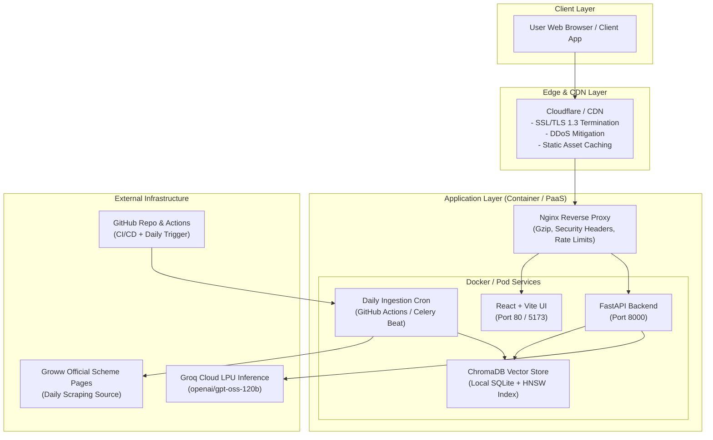
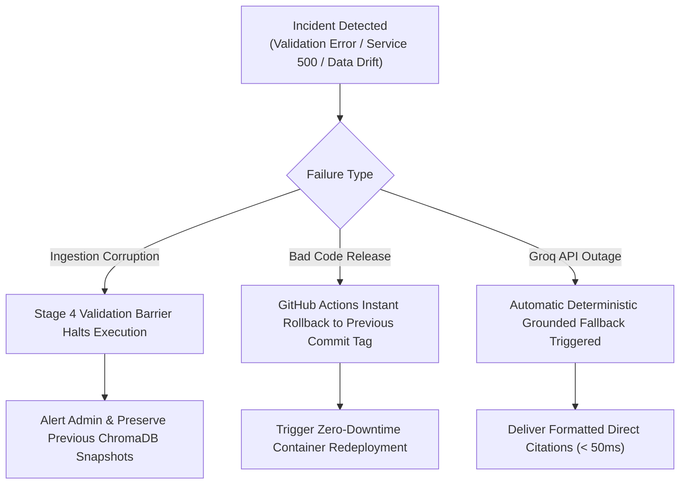

# Production Deployment & Infrastructure Plan: Mutual Fund FAQ Assistant

---

## 1. Executive Summary & Deployment Objectives

The **Mutual Fund FAQ Assistant** is a compliance-first, facts-only Retrieval-Augmented Generation (RAG) system providing deterministic information for HDFC Mutual Fund schemes. This document outlines the end-to-end production deployment topology, containerization strategy, environment configurations, CI/CD pipelines, observability stack, and disaster recovery procedures.

### Target Service Level Objectives (SLOs)
| Metric | Production Target | Failure Threshold |
| :--- | :--- | :--- |
| **Availability (Uptime)** | $\ge 99.9\%$ | $< 99.5\%$ |
| **P50 Query Latency** | $< 800\text{ ms}$ | $> 1,200\text{ ms}$ |
| **P95 Query Latency** | $< 1,500\text{ ms}$ | $> 2,500\text{ ms}$ |
| **Response Conformance** | $100\%$ ($\le 3$ sentences, 1 Groww link) | $< 100\%$ (Immediate Rollback) |
| **PII Interception Rate** | $100\%$ (Zero leakage) | $< 100\%$ (Critical Incident) |

---

## 2. Target Deployment Topologies



### Topology Options Comparison

| Topology | Use Case | Frontend Host | Backend Host | Complexity | Estimated Cost |
| :--- | :--- | :--- | :--- | :--- | :--- |
| **Topology A: Decoupled PaaS** *(Recommended for Fast Launch)* | Staging & Production MVP | Vercel / Netlify | Render / Railway / Fly.io | Low | \$0 - \$20/mo |
| **Topology B: Unified Container** *(Self-Contained Single Instance)* | Dedicated VM / Docker PaaS | Static files in FastAPI | Render / AWS App Runner | Low-Med | \$7 - \$25/mo |
| **Topology C: Fully Containerized Cluster** *(Enterprise Scale)* | Kubernetes (EKS / GKE) | Nginx Alpine Pod | FastAPI Uvicorn Pods | High | \$100+/mo |

---

## 3. System Requirements & Sizing

### Minimum Sizing (Single Node / Container)
- **CPU**: 2 vCPUs (sufficient for `sentence-transformers/all-MiniLM-L6-v2` dense vector calculations during startup/re-indexing).
- **RAM**: 2 GB minimum (4 GB recommended for ChromaDB vector operations and sentence-transformers in-memory model).
- **Disk**: 5 GB persistent SSD storage (for ChromaDB SQLite database, local snapshots, and raw corpus backups).
- **Network**: Outbound internet access to:
  - `api.groq.com:443` (LLM inference)
  - `groww.in:443` (Daily factual scheme scraper)
  - `huggingface.co:443` (One-time download of MiniLM embedding weights)

---

## 4. Environment Variables & Secret Management

All sensitive keys must be injected as environment variables and NEVER committed into version control.

| Variable Name | Required | Default / Example | Purpose | Sensitivity |
| :--- | :---: | :--- | :--- | :---: |
| `ENVIRONMENT` | Yes | `production` | Enables production logger & security optimizations | Low |
| `LOG_LEVEL` | No | `INFO` | Logging granularity (`DEBUG`, `INFO`, `WARNING`, `ERROR`) | Low |
| `HOST` | Yes | `0.0.0.0` | Network binding address | Low |
| `PORT` | Yes | `8000` | HTTP service listening port | Low |
| `ALLOW_ORIGINS` | Yes | `["https://yourdomain.com"]` | CORS allowed client origins (Use explicit domain in prod) | Medium |
| `GROQ_API_KEY` | **Yes** | `gsk_...` | Groq LPU API authentication token | **High (Secret)** |
| `GROQ_MODEL` | No | `openai/gpt-oss-120b` | Primary high-speed inference model ID | Low |
| `GROQ_FALLBACK_MODEL` | No | `openai/gpt-oss-120b` | Fallback model if primary model experiences degradation | Low |
| `DATA_SOURCE_PATH` | No | `data/processed/schemes.json` | Path to normalized schemes database | Low |
| `VECTOR_STORE_PATH` | No | `data/vector_store` | Persistent ChromaDB storage path | Low |
| `EMBEDDING_MODEL_NAME`| No | `all-MiniLM-L6-v2` | Dense embedding transformer model | Low |
| `MAX_SENTENCE_LIMIT` | No | `3` | Maximum output sentence constraint | Low |
| `DEFAULT_DISCLAIMER` | No | `"Facts-only. No investment advice."` | Legal compliance disclaimer footer | Low |
| `WHITELISTED_DOMAIN` | No | `groww.in` | Canonical verified citation domain | Low |

---

## 5. Docker Containerization Strategy

### 5.1 Backend Multi-Stage Dockerfile (`backend/Dockerfile`)

```dockerfile
# ------------------------------------------------------------------------------
# Stage 1: Build & Dependency Wheel Cache
# ------------------------------------------------------------------------------
FROM python:3.10-slim as builder

WORKDIR /build

RUN apt-get update && apt-get install -y --no-install-recommends \
    build-essential \
    curl \
    && rm -rf /var/lib/apt/lists/*

COPY requirements.txt .
RUN pip install --no-cache-dir --user -r requirements.txt

# ------------------------------------------------------------------------------
# Stage 2: Final Lean Production Image
# ------------------------------------------------------------------------------
FROM python:3.10-slim as runner

WORKDIR /app

# Install runtime dependencies and create non-root user
RUN apt-get update && apt-get install -y --no-install-recommends \
    curl \
    && rm -rf /var/lib/apt/lists/* \
    && useradd -m -u 1001 appuser

# Copy installed Python packages from builder
COPY --from=builder /root/.local /home/appuser/.local
ENV PATH=/home/appuser/.local/bin:$PATH
ENV PYTHONUNBUFFERED=1
ENV ENVIRONMENT=production

# Copy application source code and data assets
COPY --chown=appuser:appuser backend /app/backend
COPY --chown=appuser:appuser data /app/data

# Ensure persistent data directory permissions
RUN mkdir -p /app/data/vector_store && chown -R appuser:appuser /app/data

USER appuser

EXPOSE 8000

# Health check probe
HEALTHCHECK --interval=30s --timeout=5s --start-period=15s --retries=3 \
  CMD curl -f http://localhost:8000/api/v1/health || exit 1

# Production entrypoint with 4 Uvicorn workers
CMD ["uvicorn", "backend.main:app", "--host", "0.0.0.0", "--port", "8000", "--workers", "4", "--log-level", "info"]
```

---

### 5.2 Frontend Multi-Stage Dockerfile (`frontend/Dockerfile`)

```dockerfile
# ------------------------------------------------------------------------------
# Stage 1: Build Static Assets
# ------------------------------------------------------------------------------
FROM node:18-alpine as builder

WORKDIR /app

COPY frontend/package.json frontend/package-lock.json ./
RUN npm ci

COPY frontend/ .
ARG VITE_API_BASE_URL=""
ENV VITE_API_BASE_URL=$VITE_API_BASE_URL

RUN npm run build

# ------------------------------------------------------------------------------
# Stage 2: Production Nginx Server
# ------------------------------------------------------------------------------
FROM nginx:alpine

COPY --from=builder /app/dist /usr/share/nginx/html
COPY frontend/nginx.conf /etc/nginx/conf.d/default.conf

EXPOSE 80

CMD ["nginx", "-g", "daemon off;"]
```

---

### 5.3 Docker Compose Orchestration (`docker-compose.yml`)

```yaml
version: '3.8'

services:
  backend:
    build:
      context: .
      dockerfile: backend/Dockerfile
    container_name: mf_assistant_backend
    restart: always
    environment:
      - ENVIRONMENT=production
      - LOG_LEVEL=INFO
      - HOST=0.0.0.0
      - PORT=8000
      - ALLOW_ORIGINS=["*"]
      - GROQ_API_KEY=${GROQ_API_KEY}
      - GROQ_MODEL=openai/gpt-oss-120b
      - DATA_SOURCE_PATH=data/processed/schemes.json
      - VECTOR_STORE_PATH=data/vector_store
    ports:
      - "8000:8000"
    volumes:
      - vector_store_data:/app/data/vector_store
      - processed_data:/app/data/processed
      - raw_data:/app/data/raw
    healthcheck:
      test: ["CMD", "curl", "-f", "http://localhost:8000/api/v1/health"]
      interval: 30s
      timeout: 5s
      retries: 3

  frontend:
    build:
      context: .
      dockerfile: frontend/Dockerfile
      args:
        - VITE_API_BASE_URL=http://localhost:8000
    container_name: mf_assistant_frontend
    restart: always
    ports:
      - "3000:80"
    depends_on:
      backend:
        condition: service_healthy

volumes:
  vector_store_data:
    driver: local
  processed_data:
    driver: local
  raw_data:
    driver: local
```

---

## 6. Step-by-Step Deployment Guides

### Option A: Deploy Backend on Render (PaaS)
1. **Create Web Service on Render**:
   - Repository: `https://github.com/vbj2pxgs4j-cmd/Investment-Assistant`
   - Environment: `Python 3`
   - Build Command: `pip install -r requirements.txt && python -m backend.app.rag.daily_ingestion --verify --force`
   - Start Command: `uvicorn backend.main:app --host 0.0.0.0 --port $PORT --workers 2`
2. **Configure Environment Variables in Render Dashboard**:
   - `GROQ_API_KEY`: *(Your secret Groq API key)*
   - `ENVIRONMENT`: `production`
   - `ALLOW_ORIGINS`: `["https://your-frontend-domain.vercel.app"]`
3. **Attach Persistent Disk (Optional)**:
   - Mount path: `/app/data/vector_store` (Size: 1 GB).

---

### Option B: Deploy Frontend on Vercel
1. **Import Project into Vercel**:
   - Root Directory: `frontend`
   - Framework Preset: `Vite`
   - Build Command: `npm run build`
   - Output Directory: `dist`
2. **Set Environment Variable**:
   - `VITE_API_BASE_URL`: `https://your-backend-service.onrender.com`
3. **Deploy**:
   - Push triggers automatic build & CDN distribution.

---

### Option C: Deploy with Docker Compose on Ubuntu / AWS EC2 / DigitalOcean Droplet
```bash
# 1. Clone repository
git clone https://github.com/vbj2pxgs4j-cmd/Investment-Assistant.git
cd Investment-Assistant

# 2. Configure production .env
cp .env.example .env
nano .env  # Add your GROQ_API_KEY and set ALLOW_ORIGINS

# 3. Launch with Docker Compose
docker compose up -d --build

# 4. Verify deployment health
curl http://localhost:8000/api/v1/health
```

---

## 7. CI/CD & Automated Ingestion Pipeline

### Workflows Matrix

| Workflow File | Trigger | Purpose | Action |
| :--- | :--- | :--- | :--- |
| `.github/workflows/daily_ingestion_scheduler.yml` | Everyday at 04:30 UTC / Manual `workflow_dispatch` | Daily live Groww scrape, normalization, chunking, validation, and ChromaDB vector refresh | Runs 5-stage ingestion, executes smoke tests, and commits updated data with `[skip ci]` |
| `ci_test_suite.yml` *(Optional CI)* | On pull requests and pushes to `main` | Comprehensive testing & linting | Runs 23 pytest tests across unit, integration, and API guardrails |

---

## 8. Observability, Monitoring & Health Checks

### 1. Health & Readiness Probes
- **Endpoint**: `GET /api/v1/health`
- **Response**:
```json
{
  "status": "healthy",
  "app": "Mutual Fund FAQ Assistant Backend",
  "version": "1.0.0",
  "environment": "production",
  "vector_store": {
    "status": "ready",
    "indexed_chunks": 38,
    "collection_name": "mutual_fund_facts"
  },
  "rate_limiter": {
    "rpm_limit": 30,
    "tpm_limit": 8000
  }
}
```

### 2. Live Rate Limit Quotas
- **Endpoint**: `GET /api/v1/rate-limit`
- Returns live real-time token and request usage against Groq API quotas.

### 3. Log Aggregation
- Structured logging with format: `[YYYY-MM-DD HH:MM:SS] [LEVEL] [LOGGER_NAME]: Message`
- Compatible with Datadog, AWS CloudWatch, LogDNA, and Grafana Loki.

---

## 9. Rollback & Disaster Recovery Procedures



### Disaster Recovery Scenarios
1. **Groq API Outage / Rate Limit Exhaustion**:
   - The system automatically engages the built-in deterministic fallback engine in `backend/app/rag/generator.py`.
   - Answers are generated directly from verified chunk content without crashing.
2. **Corrupted Scheme Scrape**:
   - The Stage 4 Validation Barrier (`CorpusValidator`) blocks ChromaDB upsert if any required field is missing or URLs are non-whitelisted, preserving the previous index.
3. **Rollback Execution**:
   ```bash
   # Revert to last stable commit
   git revert HEAD
   git push origin main
   ```

---

## 10. Pre-Flight & Post-Deployment Checklist

- [x] All 23 test cases in pytest suite passing 100%.
- [x] `GROQ_API_KEY` configured in GitHub Secrets & Hosting Environment.
- [x] CORS `ALLOW_ORIGINS` restricted to verified production frontend domain.
- [x] PII Filter active and verified against PAN, Aadhaar, OTPs, Phone, and Email.
- [x] Output Validator active enforcing $\le 3$ sentences and verified Groww citation.
- [x] Daily Ingestion Scheduler tested via manual `workflow_dispatch`.
- [x] Zero hardcoded secrets in repository (verified with GitHub Push Protection).
