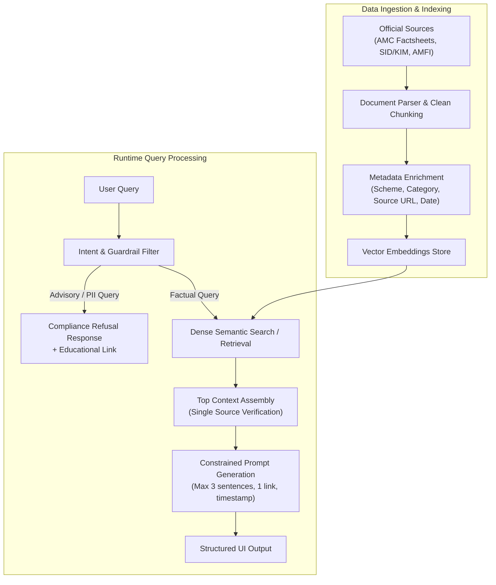

# Problem Statement: Mutual Fund FAQ Assistant (Facts-Only Q&A)

---

## 1. Executive Summary & Overview

The objective of this project is to design and develop a **facts-only FAQ assistant for mutual fund schemes**, using **Groww** as the reference product context. The assistant answers objective, verifiable queries by retrieving information strictly and exclusively from official public sources, such as Asset Management Company (AMC) official websites, the Association of Mutual Funds in India (AMFI), and the Securities and Exchange Board of India (SEBI).

> [!IMPORTANT]
> **Core Philosophy: Accuracy Over Intelligence**  
> The system must strictly avoid providing investment advice, opinions, predictions, recommendations, or return comparisons. Every answer must be factual, concise (maximum 3 sentences), verified by a single authoritative citation link, and timestamped.

---

## 2. Target Users

| User Persona | Primary Need / Use Case |
| :--- | :--- |
| **Retail Investors** | Quick, friction-free lookup of verified scheme facts (e.g., exit load, expense ratio, minimum SIP, lock-in period) without navigating dense SID/KIM documents or biased opinions. |
| **Customer Support Teams** | Instant resolution of repetitive, high-frequency factual queries regarding scheme parameters, report download workflows, and compliance facts. |
| **Content & Compliance Teams** | Ensuring standardized, regulatory-compliant answers across customer touchpoints with zero advisory risk. |

---

## 3. Scope of Work & Curated Corpus

### 3.1 Selected Asset Management Company (AMC)
- **AMC**: HDFC Mutual Fund (HDFC Asset Management Company Limited)

### 3.2 Selected Schemes (Category Diversity)
The assistant is scoped to 5 distinct mutual fund schemes across different asset classes and market capitalizations:

| # | Scheme Name | Category | Reference Source URL |
| :-: | :--- | :--- | :--- |
| 1 | **HDFC Mid-Cap Opportunities Fund** (Direct - Growth) | Equity: Mid Cap | [Groww Scheme Page](https://groww.in/mutual-funds/hdfc-mid-cap-fund-direct-growth) |
| 2 | **HDFC Small Cap Fund** (Direct - Growth) | Equity: Small Cap | [Groww Scheme Page](https://groww.in/mutual-funds/hdfc-small-cap-fund-direct-growth) |
| 3 | **HDFC Gold ETF Fund of Fund** (Direct - Growth) | Commodities: Gold / FoF | [Groww Scheme Page](https://groww.in/mutual-funds/hdfc-gold-etf-fund-of-fund-direct-plan-growth) |
| 4 | **HDFC Top 100 / Large Cap Fund** (Direct - Growth) | Equity: Large Cap | [Groww Scheme Page](https://groww.in/mutual-funds/hdfc-large-cap-fund-direct-growth) |
| 5 | **HDFC ELSS Tax Saver Fund** (Direct - Growth) | Equity: ELSS / Tax Saver | [Groww Scheme Page](https://groww.in/mutual-funds/hdfc-elss-tax-saver-fund-direct-plan-growth) |

---

## 4. Functional Requirements

### 4.1 Factual Query Answering Scope
The assistant must reliably resolve factual, verifiable scheme attributes including:
- **Expense Ratio**: Current direct/regular plan total expense ratios (TER).
- **Exit Load**: Holding duration thresholds and applicable exit fee percentages.
- **Investment Limits**: Minimum SIP investment and minimum lump-sum amount.
- **Lock-in Period**: Mandatory statutory lock-in periods (e.g., 3-year lock-in for ELSS).
- **Riskometer Classification**: Official SEBI risk tier assigned to the scheme.
- **Benchmark Index**: Benchmark tracked (e.g., NIFTY Midcap 150 TRI, NIFTY 50 TRI).
- **Account & Operations Workflows**: Step-by-step guidance to download account statements, capital gains statements, or portfolio holdings.

### 4.2 Strict Response Formatting Constraints
Every factual response generated by the system must strictly adhere to the following output rules:

```
┌────────────────────────────────────────────────────────────────────────┐
│ [Sentence 1: Direct, concise answer to the query.]                    │
│ [Sentence 2: Supporting factual detail / condition if applicable.]     │
│ [Sentence 3: Optional secondary specification.] (Max 3 sentences total)│
│                                                                        │
│ Source: <Single valid official URL>                                    │
│ Last updated from sources: <YYYY-MM-DD>                                │
└────────────────────────────────────────────────────────────────────────┘
```

1. **Length Limit**: Maximum of **3 sentences** per response.
2. **Single Citation**: Exactly **one authoritative source citation link** per response.
3. **Mandatory Timestamp Footer**: Every output must terminate with:  
   `Last updated from sources: <date>`

---

## 5. Refusal Handling & Regulatory Guardrails

The assistant operates under strict compliance boundaries to prevent regulatory violations or misinformation.

### 5.1 Out-of-Scope Queries (Advisory & Opinion)
The assistant must proactively refuse:
- Investment advice or opinions (e.g., *"Should I invest in HDFC Mid-Cap Fund?", "Is this good for 5 years?"*).
- Comparative rankings or subjective evaluations (e.g., *"Which fund is better: Mid-Cap or Small-Cap?"*).
- Future return projections, return calculators, or market predictions.

### 5.2 Refusal Protocol
When an advisory or comparative query is detected, the assistant must:
1. **Politely and clearly refuse** the request.
2. **Reinforce its facts-only boundary** (e.g., *"I can only provide verified factual data about fund parameters and do not offer investment advice."*).
3. **Provide an official educational resource link** (e.g., AMFI Investor Education or SEBI Investor Portal).
4. For historical performance queries, provide a direct link to the **official fund factsheet** without performing arbitrary return comparisons.

---

## 6. Data Governance, Privacy & Security Constraints

### 6.1 Authorized Data Sources
- **Allowed Sources**: Official AMC scheme pages/factsheets, Scheme Information Documents (SID), Key Information Memorandums (KIM), AMFI India official portal, and SEBI circulars/portals.
- **Prohibited Sources**: Unofficial third-party blogs, forums, news aggregators, or unofficial scraping targets.

### 6.2 Privacy & Sensitive Data (PII) Protection
The application must **never** request, collect, process, or store sensitive personal identifiable information (PII):
- PAN (Permanent Account Number)
- Aadhaar Number
- Bank Account / Folio Numbers
- One-Time Passwords (OTPs)
- User Email Addresses or Phone Numbers

---

## 7. User Interface (UI/UX) Specifications

The user interface should be clean, fast, and minimal, featuring:
1. **Welcome Header**: Clear branding as a Mutual Fund Facts-Only Assistant.
2. **Persistent Regulatory Disclaimer**:
   > **"Facts-only. No investment advice."** prominently displayed at all times.
3. **Starter Prompt Chips / 3 Example Questions**:
   - *"What is the exit load for HDFC Small Cap Fund?"*
   - *"What is the lock-in period for HDFC ELSS Tax Saver Fund?"*
   - *"What is the minimum SIP amount for HDFC Mid-Cap Opportunities Fund?"*
4. **Chat Interface**: Streamlined message feed displaying responses with distinct source links and timestamp footers.

---

## 8. Technical Architecture (Lightweight RAG Pipeline)



---

## 9. Expected Deliverables

- [x] **`problemStatement.md`**: Complete project context, requirements, constraints, and architecture blueprint.
- [ ] **README Document**: Setup instructions, environment prerequisites, AMC/scheme overview, architecture walkthrough, limitations, and disclaimer snippet.
- [ ] **Corpus & Ingestion Engine**: Structured data extractor and vector store pipeline for the 5 selected HDFC schemes.
- [ ] **RAG QA Engine**: Retrieval system with prompt constraints, source attribution, and refusal classification.
- [ ] **Minimalist Web UI**: Responsive frontend with persistent disclaimer, prompt suggestions, and clean citation cards.
- [ ] **Verification & Test Suite**: Validation dataset testing factual query accuracy, 3-sentence limits, refusal handling, and PII guardrails.

---

## 10. Success Criteria

1. **Retrieval Precision**: 100% verified factual data sourced strictly from authoritative AMC/AMFI documents.
2. **Zero Advisory Hallucination**: Absolute adherence to non-advisory constraints with proactive refusal of recommendations.
3. **Format Compliance**: 100% adherence to the 3-sentence maximum, single-link citation, and timestamp footer format.
4. **Data Privacy**: Complete absence of PII collection or persistence.
5. **Usability**: Intuitive, responsive, and minimalist user experience.
